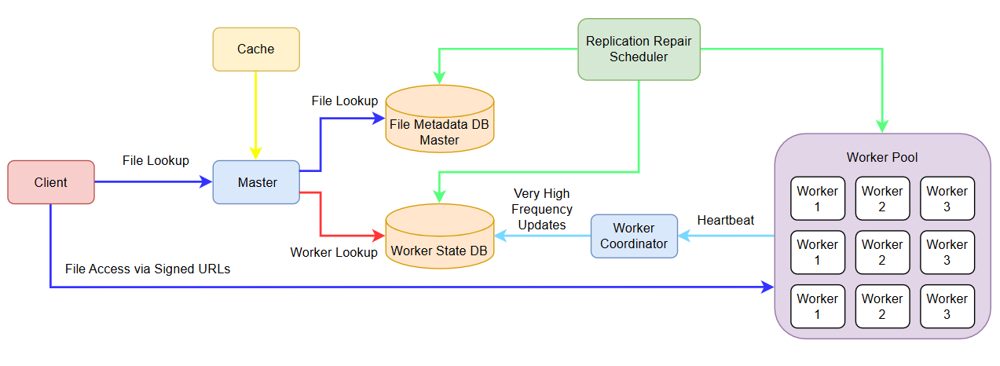

# MiniS3 Distributed Storage Architecture

MiniS3 is a distributed object storage system designed to provide **high availability, scalable storage, and fast file retrieval**. MiniS3 uses a **centralized metadata architecture with distributed data storage**.

The system separates the **control plane** from the **data plane**, allowing the cluster to scale horizontally while maintaining efficient metadata lookups.

---

# System Overview

The architecture consists of the following major components:

* **Client**
* **Master Service**
* **Cache Layer**
* **File Metadata Database**
* **Worker State Database**
* **Worker Coordinator**
* **Replication Repair Service**
* **Worker Pool**

The master node orchestrates metadata and worker selection, while actual file data is stored on worker nodes.

---

# Architecture Diagram



---

## Goals

MiniS3 is designed as a distributed storage system optimized for **high availability, scalability, and operational simplicity**. The architecture intentionally prioritizes **availability and durability over strict consistency**, making it suitable for large-scale storage workloads where read throughput and fault tolerance are more critical than immediate consistency.

---

### High Availability (HA)

The system is designed to remain operational even when individual components fail.

Key mechanisms:

* Files are stored with **multiple replicas across workers**
* Replicas are placed across **different racks when possible**
* **Replication repair services** automatically restore missing replicas
* Clients access files through **any healthy replica**

This ensures that **node failures, disk failures, or rack failures do not cause data loss or service outages**.

---

### AP-Oriented Storage Layer

The storage layer follows an **AP model** under the CAP theorem.

This means the system prioritizes:

```
Availability + Partition Tolerance
```

Behavior during failures:

* Reads and writes continue even during network partitions
* Replication may temporarily fall below the desired replication factor
* The system **repairs replicas asynchronously**

This approach avoids blocking client requests when parts of the cluster become unavailable.

---

### Eventual Consistency

MiniS3 follows an **eventually consistent replication model**.

When a file is uploaded:

1. Replicas are created across worker nodes.
2. Replication acknowledgements update the metadata system.
3. If replicas are lost due to failures, the **replication repair service** restores them in the background.

Temporary inconsistencies may exist, but the system guarantees that:

```
replication_factor → eventually restored
```

This allows the system to maintain **availability without requiring synchronous quorum writes**.

---

### Horizontal Scalability

The system is designed to scale independently across multiple layers.

Scaling characteristics:

| Component       | Scaling Method                          |
| --------------- | --------------------------------------- |
| Master Services | Horizontal scaling behind load balancer |
| Worker Pool     | Add more storage nodes                  |
| Metadata DB     | Read replicas and caching               |
| Worker State DB | Separate high-frequency update path     |
| Cache Layer     | Distributed cache if needed             |

This separation prevents any single subsystem from becoming an early bottleneck.

---

### Control Plane / Data Plane Separation

MiniS3 separates coordination logic from data transfer.

**Control Plane**

Responsible for system orchestration.

* Master services
* Metadata database
* Worker state database
* Replication repair

**Data Plane**

Responsible for file transfer.

* Client
* Worker nodes

File data flows directly between clients and workers using **signed URLs**, preventing the master layer from becoming a bandwidth bottleneck.

---

### Efficient Metadata Lookup

File retrieval is optimized through centralized metadata.

The metadata system maintains:

```
file_key → replica locations
```

Benefits:

* fast lookup
* small metadata footprint
* easy caching
* efficient routing

Since metadata is small compared to file data, a centralized metadata store allows **very fast read-heavy workloads**.

---

### Fault Isolation

Different system concerns are handled by different subsystems.

| Concern                           | Component                  |
| --------------------------------- | -------------------------- |
| Namespace and file placement      | Metadata DB                |
| Worker liveness and runtime stats | Worker State DB            |
| High-frequency logs               | Logging subsystem          |
| Replica durability                | Replication Repair Service |

This separation prevents high-frequency updates (like heartbeats) from overwhelming the metadata store.

---

### Self-Healing Storage

The system continuously monitors replication state.

When a file has fewer replicas than required:

```
replica_count < replication_factor
```

the replication repair service automatically creates new replicas.

This ensures the system maintains durability even when nodes fail.

---

### Operational Simplicity

The design intentionally avoids complex decentralized placement algorithms such as consistent hashing.

Instead, the system relies on:

* centralized metadata
* simple worker selection
* asynchronous repair

This keeps the architecture easier to operate, debug, and extend.

---

### Summary

MiniS3 targets the following system properties:

* **High Availability (HA)**
* **AP-oriented storage model**
* **Eventual Consistency**
* **Horizontal Scalability**
* **Efficient metadata lookup**
* **Self-healing replication**
* **Control plane / data plane separation**

These goals make the system well suited for **large-scale, read-heavy distributed storage environments** where durability and availability are prioritized over strict consistency.

